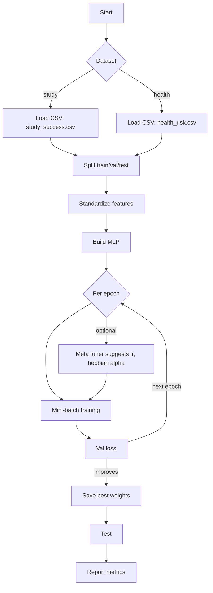
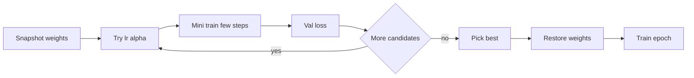

# MLP with optional Hebbian plasticity and simple meta-learning (NumPy)

This project builds a tiny, framework-free MLP in NumPy, trains it on a human-understandable dataset (study habits -> exam success), and optionally applies Hebbian plasticity and a simple meta-learning tuner.

## Dataset

Two human-understandable datasets are supported:

1) Study success (`data/study_success.csv`):
- hours_studied (0-10)
- sleep_hours (4-10)
- attendance_rate (0.5-1.0)
- has_breakfast (0 or 1)
- final_score (0-100, noisy but driven by the above)
- passed (0 or 1; 1 if final_score >= 60)

2) Health risk (`data/health_risk.csv`):
- bmi (15-45)
- steps_per_day (1k–18k)
- daily_calories (1200–4000)
- risk_score (0-100)
- high_risk (0 or 1; based on score)

The data is generated by `src/data_generator.py` with a transparent formula plus small noise, so it’s easy to reason about.

## Features

- NumPy MLP with ReLU/Sigmoid/Tanh/Linear activations
- Mini-batch SGD with momentum or Adam
- Weight decay (L2) regularization
- Optional Hebbian plasticity (Oja-like rule) blended with backprop
- Tiny meta-learning tuner that searches learning rate and plasticity strength on a validation split (single-task mode)
- Optional multi-task head for health dataset: classify high_risk and regress risk_score jointly
- Save/load model weights

### 2D decision boundary (perceptron + logistic)

You can visualize the health data as dots and draw a linear separator (like a perceptron) over two features:

```powershell
python src\plot_separator.py --data data\health_risk.csv --x bmi --y steps_per_day --out plots\health_separator_bmi_steps.png --epochs 30 --lr 0.05
```

Notes:
- Points are colored by `high_risk` (0 = no risk, 1 = high risk).
- The dashed line is the perceptron boundary fitted on the two selected features.
- Features are standardized internally for stable fitting (disable with `--no-standardize`).

Prefer a smoother separator? Also plot logistic regression’s 0.5 probability line alongside the perceptron:

```powershell
python src\plot_separator.py --data data\health_risk.csv --x bmi --y steps_per_day --out plots\health_separator_bmi_steps_both.png --epochs 30 --lr 0.05 --use-logistic --log-epochs 200 --log-lr 0.1
```

Here the solid green line is the logistic regression p=0.5 boundary.

### Metrics logging and plots

- Log per-epoch metrics to CSV:

```powershell
python src\train.py --dataset health --epochs 8 --batch-size 64 --lr 0.01 --use-adam --weight-decay 0.001 --multi-task --mt-weight 0.25 --log-csv metrics\health_mt.csv
```

- Save loss curves (train/val) to a PNG:

```powershell
python src\train.py --dataset health --epochs 8 --batch-size 64 --lr 0.01 --use-adam --weight-decay 0.001 --multi-task --mt-weight 0.25 --plot-out plots\health_mt_loss.png --plot-title "Health MT Loss"
```

Notes:
- CSV columns: timestamp, epoch, train_loss, val_loss, lr, hebbian_alpha, and per-layer weight norms as wnorm_l0, wnorm_l1, ...
- Plotting requires matplotlib (already listed in requirements)
 - The plots include a dashed vertical line at the epoch with best validation loss to visually divide the curve at the best point.

Weight norm curves:

- Save per-layer weight norms (Frobenius norm of W per layer) to a PNG:

```powershell
python src\train.py --dataset health --epochs 8 --batch-size 64 --lr 0.01 --use-adam --weight-decay 0.001 --multi-task --mt-weight 0.25 --plot-weights-out plots\health_mt_weights.png
```

This helps visualize how each layer’s weight magnitude evolves during training.

#### Training visualization options

- Loss curves (train/val): `--plot-out <png>` (use `--plot-title` to set the title)
- Weight norm curves per layer: `--plot-weights-out <png>`
- Logging to CSV: `--log-csv <csv>`
- CSV columns include per-layer Frobenius norms as `wnorm_l0`, `wnorm_l1`, ...
- A dashed vertical line marks the best validation epoch on both plots

Example (all together):

```powershell
python src\train.py --dataset health --epochs 12 --batch-size 64 --lr 0.01 --use-adam --weight-decay 0.001 --multi-task --mt-weight 0.25 --log-csv metrics\health_mt.csv --plot-out plots\health_mt_loss.png --plot-weights-out plots\health_mt_weights.png --plot-title "Health MT"
```

## How it works (visual guide)

### Training pipeline



### Architectures

- Study (classification): `4 → 16 → 8 → 1` with `[ReLU, ReLU, Linear]`
- Health single-task (classification): `3 → 32 → 16 → 1` with `[ReLU, ReLU, Linear]`
- Health multi-task (classification + regression): `3 → 32 → 16 → 2` with `[ReLU, ReLU, Linear]`

Why Linear at the end?
- Feed raw logits to a stable BCE-with-logits for classification
- Use raw output for regression (risk_score in [0,1])

### Backprop + Hebbian plasticity

Weight update per batch blends supervised gradient descent with an optional Hebbian increment.

Backprop step (conceptual):

$$
\Delta W_{bp} = -\eta\; \nabla_W \mathcal{L}\; (\text{with momentum/Adam})
$$

L2 weight decay:

$$
\nabla_W \mathcal{L} \leftarrow \nabla_W \mathcal{L} + \lambda W
$$

Oja-like Hebbian increment (mini-batch; pre-activations x, post-activations y):

$$
\Delta W_{hebb} = \alpha\Big(\frac{y^T x}{B} - \gamma \; (\mu_{y^2}\, W)\Big)
$$

Final update:

$$
W \leftarrow W - \text{OptStep}(\nabla_W\mathcal{L}) + \Delta W_{hebb}
$$

where alpha is `--hebbian-alpha`, gamma is `--hebbian-decay`.
Here, $\mu_{y^2}$ denotes the mini-batch mean of $y^2$.

#### Hebbian effect per layer (tiny example)

Consider one mini-batch sample with:
- pre-activations x = [0.8, 0.2]
- post-activations y = [0.9, 0.1]
- alpha = 0.02, gamma = 0.01, W starts at 0

Outer product term (B=1): y^T x =

$$
\begin{bmatrix}
0.9\\ 0.1
\end{bmatrix}
\begin{bmatrix}
0.8 & 0.2
\end{bmatrix}
=
\begin{bmatrix}
0.72 & 0.18\\
0.08 & 0.02
\end{bmatrix}
$$

Decay term uses mean(y^2)·W. With W=0 initially, it’s 0. Thus:

$$
\Delta W_{hebb} = 0.02 \times
\begin{bmatrix}
0.72 & 0.18\\
0.08 & 0.02
\end{bmatrix}
=
\begin{bmatrix}
0.0144 & 0.0036\\
0.0016 & 0.0004
\end{bmatrix}
$$

Interpretation: co-activation of input and output units increases their connecting weights; the Oja decay term keeps weights bounded over time.

### Meta-learning tuner (single-task only)

File: `src/meta.py`

Per epoch the tuner:
1. Snapshots current weights
2. Tries a small set of candidates (lr, alpha)
3. For each, runs a few quick mini-steps on a subset
4. Picks the candidate with best val loss
5. Restores weights and uses that lr, alpha for the real epoch



### Multi-task (health dataset)

When `--multi-task` is set:
- Head 0: classification logit for `high_risk` → BCE-with-logits
- Head 1: regression for `risk_score ∈ [0,1]` → MSE

Combined loss:

$$
\mathcal{L} = \mathrm{BCEWithLogits}(\hat{y}_{cls}, y_{cls}) + w_{mt}\, \mathrm{MSE}(\hat{y}_{score}, y_{score})
$$

with `w_mt = --mt-weight`.

Tip: For the health dataset, the default multi-task architecture is already larger (3→32→16→2). Start with Adam (`--use-adam`), a modest learning rate (e.g., `--lr 0.01`), and weight decay around `--weight-decay 0.001`.

## Quick start

1) Create data (or let the training script create it automatically):

```powershell
python src\data_generator.py --rows 1200 --out data\study_success.csv
python src\health_data_generator.py --rows 1200 --out data\health_risk.csv
```

2) Train the model:

```powershell
python src\train.py --data data\study_success.csv --epochs 25 --batch-size 64 --lr 0.05 --hebbian-alpha 0.02 --use-hebbian --use-meta
python src\train.py --dataset health --epochs 25 --batch-size 64 --lr 0.03 --use-adam --weight-decay 0.0005
python src\train.py --dataset health --epochs 8 --batch-size 64 --lr 0.01 --use-adam --weight-decay 0.001 --multi-task --mt-weight 0.25
```

Common flags:
- `--use-hebbian` to enable Hebbian plasticity updates
- `--hebbian-alpha` plasticity strength (0 disables effect)
- `--hebbian-decay` decay for Oja-like stabilization
- `--use-meta` enable tiny meta tuner over `lr` and `hebbian-alpha`

3) Outputs
- Saves best weights to `models/best_weights.npz`
- Prints train/val/test metrics

## File map
- `src/mlp_core.py` – MLP core with BP + optional Hebbian
- `src/data_generator.py` – Generates the study-success CSV
- `src/health_data_generator.py` – Generates the health-risk CSV
- `src/meta.py` – Simple hyperparameter tuner (lr, hebbian-alpha)
- `src/train.py` – Train/evaluate pipeline with dataset auto-detection
- `src/plot_separator.py` – 2D scatter with perceptron/logistic separator over any two selected features

## Debug tips

- Loss explodes or becomes NaN
	- Lower `--lr` (e.g., 0.01 → 0.005 → 0.001)
	- Use `--use-adam` and/or increase `--weight-decay` (e.g., 1e-4 → 1e-3)
	- Reduce or disable Hebbian: set `--hebbian-alpha 0` or lower `--hebbian-alpha`/`--hebbian-decay`
	- Ensure your CSV schema is auto-detected correctly (see columns listed above)

- Accuracy plateaus
	- For health: try the larger model (default) or raise epochs to 50+
	- Tune `--lr` and consider enabling `--use-meta` (single-task only)
	- Verify features are standardized (train/val/test are standardized using train stats)

- Multi-task instability
	- Lower `--mt-weight` (e.g., 0.5 → 0.25)
	- Use Adam with modest `--lr` (e.g., 0.01) and `--weight-decay` (e.g., 1e-3)
	- Temporarily disable Hebbian to isolate issues

- Dataset sanity checks
	- Inspect CSVs to ensure labels are in [0,1] and value ranges look reasonable
	- Re-generate data with different `--rows` and re-run
	- Set `--seed` to a fixed value for reproducibility

## Command reference

### Training (`src/train.py`)

- Data
	- `--dataset {study,health}` or `--data <csv>`
	- `--seed <int>` for reproducibility
- Optimization
	- `--epochs <int>` `--batch-size <int>` `--lr <float>` `--momentum <float>`
	- `--use-adam` with `--beta1 <float>` `--beta2 <float>` `--eps <float>`
	- `--weight-decay <float>` (L2)
	- `--clip <float>` gradient clipping norm
- Hebbian (optional)
	- `--use-hebbian` `--hebbian-alpha <float>` `--hebbian-decay <float>`
- Meta tuner (single-task only)
	- `--use-meta`
- Multi-task (health only)
	- `--multi-task` `--mt-weight <float>`
- Logging and plots
	- `--log-csv <path>` per-epoch metrics (includes `wnorm_l*` columns)
	- `--plot-out <png>` train/val loss with best-epoch marker
	- `--plot-weights-out <png>` per-layer weight norms with best-epoch marker
	- `--plot-title <str>`

### 2D separator plot (`src/plot_separator.py`)

- Data and features
	- `--data <csv>` (auto-generated if missing)
	- `--x <column>` `--y <column>` e.g., `bmi`, `steps_per_day`, `daily_calories`
	- `--label <column>` default `high_risk`
	- `--no-standardize` to disable standardization before fitting
- Perceptron
	- `--epochs <int>` `--lr <float>`
- Logistic regression (optional)
	- `--use-logistic` to enable
	- `--log-epochs <int>` `--log-lr <float>` `--log-l2 <float>`
- Output
	- `--out <png>` output image path

## Notes
- Pure NumPy, only dependency is `numpy`.
- Designed for clarity over speed; suitable for learning and small demos.
